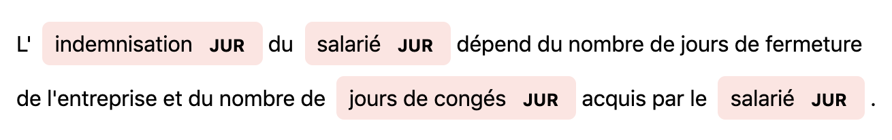
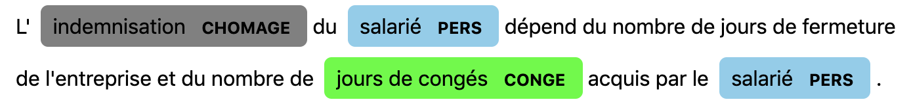

# juritagger


[](https://pypi.python.org/pypi/juritagger)
[](https://travis-ci.org/ArmandGiraud/juritagger)


tag a text string with droit du travail entities

## Table of Content:

- [Intallation](#installation)
- [Usage](#usage)
- [TODO](#todo)
- [Contributing](#contributing)
- [Credits](#credits)

## Installation


```batch

    $ pip install juritagger
```

This is the preferred method to install juritagger, as it will always
install the most recent stable release.

If you don't have [pip](https://pip.pypa.io) installed, this 
[Python installation guide](http://docs.python-guide.org/en/latest/starting/installation/) 
can guide you through the process.

## Usage
### simple usage
```python
from juritagger import JuriMatcher

opts = {
        "spacy_model" : "fr_core_news_md"
        }
jm = JuriMatcher(**opts)

text = """L'indemnisation du salarié dépend du nombre de jours de fermeture
de l'entreprise et du nombre de jours de congés JUR acquis par le salarié."""

matches, doc = jm.tag_doc(fiche_text, mode = "flat")
matches

[OUT]
>>> [('JUR', 1, 2),
>>> ('JUR', 3, 4),
>>> ('JUR', 19, 22),
>>> ('JUR', 21, 22),
>>> ('JUR', 26, 27)]
```


### classified terms

```python
from juritagger import JuriMatcher

opts = {
        "spacy_model" : "fr_core_news_md"
        }
jm = JuriMatcher(**opts)

text = """L'indemnisation du salarié dépend du nombre de jours de fermeture
de l'entreprise et du nombre de jours de congés JUR acquis par le salarié."""

matches, doc = jm.tag_doc(fiche_text, mode = "class")
matches

>>>[('CHOMAGE', 1, 2),
>>> ('PERS', 3, 4),
>>> ('PERS', 3, 4),
>>> ('CONGE', 19, 22),
>>> ('CONGE', 21, 22),
>>> ('PERS', 26, 27),
>>> ('PERS', 26, 27)]
```



### visualize entities

```python
from juritagger.display_entities import serve_ents, keep_longer_match, COLOR_LIST

matches = keep_longer_match(matches) # remove overlapping matches

from display_entities import COLOR_LIST

options = {
    "ents": list(jm.entity_types),
    "colors" : {entity:COLOR_LIST[i] for i, entity in enumerate(jm.entity_types)}
}

serve_ents(doc, matches, options=options)
```
then go to ```http://localhost:5000/```

## TODO

- [x] Add Test to display
- [ ] Add Test to main class


## Contributing

Contributions are welcome, and they are greatly appreciated! Every
little bit helps, and credit will always be given.

For more info please click [here](./CONTRIBUTING.md)


## Credits

This package was created with Cookiecutter and the `oldani/cookiecutter-simple-pypackage` project template.

- [Cookiecutter](https://github.com/audreyr/cookiecutter)
- [oldani/cookiecutter-simple-pypackage](https://github.com/oldani/cookiecutter-simple-pypackage)
